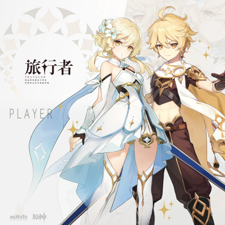

# 1 引言

## 1.1 游戏制作商与平台

《原神》是由上海米哈游制作发行的一款开放世界冒险游戏，于2017年1月底立项，原初测试于2019年6月21日开启，再临测试于2020年3月19日开启，启程测试于2020年6月11日开启，PC版技术性开放测试于9月15日开启，公测于2020年9月28日开启。在数据方面，同在官方服务器的情况下，iOS、PC、Android平台之间的账号数据互通，玩家可以在同一账号下切换设备。

## 1.2 《原神》的大世界观

游戏发生在一个被称作“提瓦特”的幻想世界，在这里，被神选中的人将被授予“神之眼”，导引元素之力。玩家将扮演一位名为“旅行者”的神秘角色，在自由的旅行中邂逅性格各异、能力独特的同伴们，和他们一起击败强敌，找回失散的亲人——同时，逐步发掘“原神”的真相。

# 2 背景设定

这里是七种元素交汇的幻想世界“提瓦特”。在遥远的过去，人们藉由对神灵的信仰，获赐了驱动元素的力量，得以在荒野中筑起家园。五百年前，古国的覆灭却使得天地变异……如今，席卷大陆的灾难已经停息，和平却仍未如期光临。作为故事的主人公，你从世界之外漂流而来，降临大地。你将在这广阔的世界中，自由旅行、结识同伴、寻找掌控尘世元素的七神，直到与分离的血亲重聚。

# 3 角色设定

## 3.1 可操控角色

**3.1.1 角色获取**

游戏中拥有许多可操控角色，开局的默认角色可以选择男女，此外的角色性别固定。除旅行者外的角色，可以通过剧情、祈愿和活动获取。如安柏是游戏中除主角外，玩家可通过剧情激活的第一个角色。大部分角色都需要通过祈愿获取，祈愿分为常驻祈愿和活动祈愿，祈愿需要消耗相遇之缘或纠缠之缘。

**3.1.2 体力值**

游戏中的角色拥有体力值的设定，在飞行、奔跑、游泳和蓄力攻击（除弓箭角色外）会消耗，体力为0时会使角色进入步行（奔跑）、坠落（滑翔与攀爬）、溺水死亡（游泳）和无法进行蓄力攻击的状态。体力可以通过体力恢复的料理和休息恢复。在动作进行的时候也可以通过呼出面板食用料理进行恢复。

**3.1.3 角色培养**

|  **表1 角色培养** |                                                                                                                                                                                                                                                                                                           |
|-------------------|-----------------------------------------------------------------------------------------------------------------------------------------------------------------------------------------------------------------------------------------------------------------------------------------------------------|
| 突破              | 当角色达到一定等级时，可通过角色突破来提高角色的等级上限。同时，旅行者需要达到一定冒险等阶，才可进行角色突破操作。角色突破除了可以提升等级上限外，还可以提升角色的生命值等属性。                                                                                                                          |
| 天赋              | 不同的角色拥有各自的天赋，赋予他们各式各样的能力与特长。升级天赋可以提升角色的能力。部分天赋需要在角色突破达到一定等级后才可进行解锁或升级。消耗对应道具素材即可完成天赋的升级                                                                                                                            |
| 命之座            | 每位角色拥有6层命之座，命之座能提升扩展角色天赋。通过祈愿或领取冒险等阶奖励，可获得不同角色的命之座激活道具，激活命之座。如果玩家抽取到已有的角色，那么角色将会化作该角色的命星，命星可以用来激活角色的命之座。激活命之座可以全方面的提升角色能力，而且还有特殊效果，例如降低体力消耗、减少特定技能冷却等 |

**3.1.4 角色介绍（部分）**

主角

旅行者·荧

配音：宴宁（汉语），悠木碧（日语）

简介：你的故国已经覆灭，宫城万倾也化作尘沙。

你是本应该拥有世界，拥抱天地之人。

但亡国的末裔啊，请不要悲叹这些逝去的时刻……

旅行者·空

配音：鹿喑（汉语），堀江瞬（日语）

简介：……只要你拥有的高洁与善良不会改变，在新的天地，依然会有最好的伙伴与你同行。

此处前方，此刻未来，皆是你的天地。

欢迎来到世界。

蒙德

西风骑士团代理团长·琴

“风啊，回应我吧！”

配音：林簌（汉语），斋藤千和（日语）

简介：身为西风骑士团的代理团长，琴一直忠于职守，为人们带来安宁。虽然并非天赋异禀，但通过刻苦训练，如今的她已然能够独当一面。

当风魔龙的威胁开始临近，这位可靠的代理团长早已做好了准备，誓要守护蒙德。

逃跑的太阳·可莉

“可莉还想出去玩！带我出去玩！”

配音：花玲（汉语），久野美咲（日语）

简介：西风骑士团，火花骑士！永远伴随闪光与爆炸出现！

——然后在琴团长严厉的目光注视下默默消失。

虽然新炸药的配方，很多都是在被关禁闭的时候想出来的……

但如果不被关禁闭的话，就更好了。

# 4 物品道具

## 4.1 武器装备

玩家可操控角色拥有两类装备，一类是武器，按照角色的攻击方式装备对应的武器；一类是圣遗物，装备在角色身上的道具，组成套装会有额外属性。

**表2 武器装备**

| **类型**   | **介绍**                                                                                                                                                                                   |
|------------|--------------------------------------------------------------------------------------------------------------------------------------------------------------------------------------------|
| **武器**   | 游戏中的武器和圣遗物可通过地下城挑战、开宝箱以及任务等方式获取。武器会按星级区分品质，分为金色五星，紫色四星，蓝色三星和绿色二星。三星以上的物品会有附加词缀属性，并且可精炼强化词缀的等级 |
| **圣遗物** | 圣遗物分为了五种，羽冠、杯皿、时针、花和鸟羽。圣遗物可以组成套装，获得套装的技能，不同数量下的套装所组合出来的技能都有所不同，分为两件套和四件套技能                                       |

## 4.2 道具强化

游戏拥有强化系统，可以消耗其他武器或者强化素材进行强化。圣遗物可以通过消耗其他圣遗物进行强化或者强化素材进行强化。三星以上的武器还附带词缀，类似于被动，而且词缀可以通过武器精炼提升。

**表3 道具强化**

| 类型 | 介绍                                                                                                                                                           |
|------|----------------------------------------------------------------------------------------------------------------------------------------------------------------|
| 强化 | 玩家可通过使用其他武器或者强化素材进行武器强化，圣遗物同理。强化素材可以拿矿石找铁匠兑换，或者开宝箱获取。圣遗物暂时没有强化素材，只有通过吃其他圣遗物进行强化 |
| 精炼 | 武器会按星级区分品质，三星以上的物品会有附加词缀属性，并且可通过吃掉同名武器进行精炼强化词缀的等级                                                             |

# 5 场景地图

《原神》的冒险在拥有七座主要城邦的提瓦特大陆展开
。玩家来到新区域激活一座七天神像，地图上就会解锁新区域。目前已开放蒙德、璃月、稻妻三个城邦供玩家探索。

## 5.1 场景

游戏中的墙体、山脉、树木、箱子基本都可以进行攀爬翻越，靠近障碍物时，角色会自动进行攀爬动作。按空格键可向上窜一小段距离，加快攀爬速率，按X键则可从墙上跳下。剧情中获得风之翼后，玩家可以在高处跳下使用滑翔动作。

## 5.2 天气

游戏拥有天气系统，随着时间变化，白天黑夜会相互切换，也有几率碰到下雨天气。下雨天气里，处于雨幕覆盖的区域将转化为携带有水元素的潮湿状态。此时，若角色释放冰系技能，则能直接将之冰冻，无需借助其他繁杂的手段创造冰冻条件。雨天会有落雷，被雷劈中会扣除一定生命值，首次被劈中会完成一个成就。在这期间野外的篝火也将被打湿，玩家无法借此完成烹饪，即火元素无法触发
。

## 5.3 传送锚点

游戏地图上坐落着许多传送锚点，玩家靠近锚点按F键即可解锁，每解锁一个传送锚点都会获得一定量的冒险阅历和一个风之印，之后按M键打开地图，选择想要移动的锚点，点击移动即可传送过去。玩家可以通过地图寻找锚点进行解锁，未解锁的锚点，地图上也会有显示。

## 5.4 七天神像

游戏地图上除了传送锚点外，七天神像也具有传送功能。除了传送外，神像还拥有调整队伍配置和消耗恩泽点数恢复角色的血量的功能，恩泽点数会随时间自动恢复，角色死亡后也可靠近神像进行复活。玩家将在野外获取的冒险道具“散失的神曈”供奉给神像，可包含体力上限、冒险阅历、原石和元素之印等馈赠。

**5.5 宝箱**

游戏野外会随机出现宝箱，这些宝箱大多都需要通过解谜获取。比如需要使用对应属性的角色的攻击激活的元素方碑，触发获取宝箱战斗的灯草，需要全部射下才能解锁宝箱的蓬蓬果，需要搜集仙灵点亮的仙灵灯，点亮后解锁宝箱的火把等。

# 6 游戏评价

《原神》整体的玩法架构可圈可点，基于行业成熟设计经验打造的内容虽算不上太惊艳，但也多少有些自己的想法，玩起来不失乐趣。*（17173
评）*

随着游戏体验的深入，《塞尔达》的既视感逐渐消失，取而代之的是浓厚的"米哈游"味道，经由《崩坏3》锤炼的3D动作设计在《原神》中有着完善的展现，角色的塑造和剧情对白中的桥段也有些《崩坏》系列的影子
。*（游侠网 评）*

与同世代的一线大作相比，《原神》和米哈游还有很长的路要走，但项目本身至少让国产游戏行业看到了一丝追逐的光芒
。*（网易爱玩 评）*

游戏整体的可玩性非常值得认可，玩家永远不必担心，在《原神》的世界里会无事可做，不必担心内容更新的匮乏，在七大国的疆土上，永远会有新的冒险在等待着玩家去发现
。*（3DM 评）*

《原神》用无与伦比的画面把一场场战斗变成了一次次视觉奇观。无论你是在搜索食材、飞越山峰，还是与其他玩家联手对抗强大
BOSS，这片大陆的每一寸空间都精雕细琢，让你感觉不虚此行。*（App Store 评）*

《原神》是一款惊人的开放世界冒险游戏，它吸收了大量的《塞尔达：荒野之息》和动画的灵感来创造出一些真正特别的东西。虽然有一些抽卡微交易模型存在一些不佳的氪金体验，但出色的战斗和令人上瘾的探索以及这美丽的世界让这款游戏成为IGN编辑一整年玩过的最令人兴奋的游戏之一。*（IGN
评）*

《原神》是一款扎实的游戏，略微受到免费模式限制妨碍。游戏总体价值很高，核心玩法没问题，尤其是元素互动系统非常有趣，个性很鲜明
。*（Gamespot 评）*
